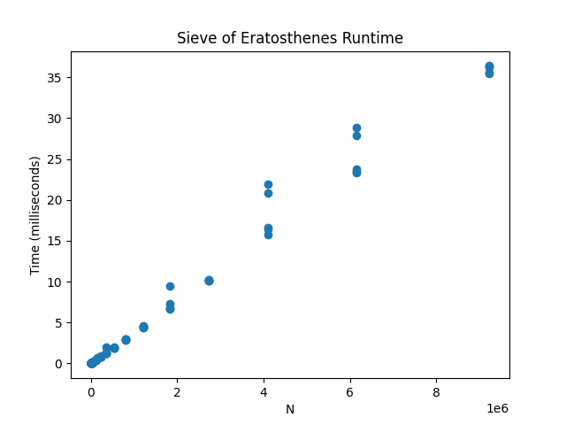
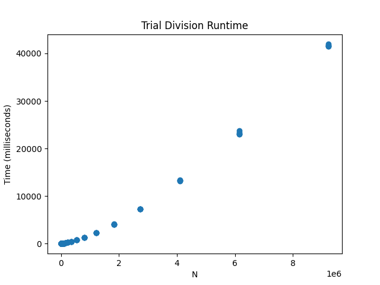

# TITLE

A lightweight C++ and Python tool for measuring the runtime performance of two prime counting and generation algorithms with graphical visualization. 

## Table of Contents
1. [Motivation](#motivation)
2. [Features](#features)
3. [Example](#example)
4. [Installation](#installation)
5. [Usage](#usage)
6. [How It Works](#how-it-works)
7. [Project Structure](#project-structure)
8. [Limitations and Future Improvements](#limitations-and-future-improvements)

## Motivation

I wanted a short yet practical project to develop my skills in C++, Python, and Make. As a math enthusiast, I thought that a prime benchmarking tool would be perfect. Building this prime benchmarking tool, I learned about

- The std::chrono C++ library
- Pipelining with C++ and Python
- Reading CSV files with the pandas library in Python
- Creating plots with the matplotlib library in Python
- Automating building and testing using Make
- Writing professional READMEs
- And other supporting tools and workflows.

I chose to test the Trial Division and Sieve of Eratosthenes algorithms to contrast a naive prime generation method with a more efficient approach.

## Features

- Trial division algorithm to compute the $n$-th prime.
- Sieve of Eratosthenes algorithm to compute the number of primes up to $n$.
- Benchmarking algorithm to record the runtime of the above algorithms for various values of $n$ and record results in CSV files.
- Python script to generate plots to visualize the results of the benchmarking algorithm.

## Example

The following results were obtained when run on an AMD Ryzen 7 8840HS (3301 Mhz, 8 Cores 16 Logical Processors, Radeon 780M Graphics) with 16 GB DDR5 RAM.

 

## Installation

### Prerequisites
- A POSIX-compliant OS
- C++ compiler with C++17 support
- Make
- Python 3.8+
- Python packages: pandas, matplotlib

### Clone the repository
```bash
git clone git@github.com:abbasikareem/prime-benchmark.git
cd prime-benchmark
```

## Usage

Once installed, navigate to the ``prime-benchmark`` directory and enter
```bash
make
```
into the terminal. The program may take a few minutes to run. When the program has finished, the benchmark CSV files can be found in the ``prime-benchmark/csvs`` directory, and the runtime plots can be found in the ``prime-benchmark/plots`` directory.

## How It Works

### Trial Division

Implemented in C++ for speed, the Trial Division algorithm iteratively computes the $n$-th prime number by testing the divisibility of candidates with all previously found primes. This algorithm is simple but inefficient, scaling as $O(n \sqrt{n})$.

### Sieve of Eratosthenes

Also implemented in C++ for speed, the Sieve of Eratosthenes algorithm counts the number of primes up to an integer $n$ by sifting through the integers 2 through $n$ as follows. 

Let $p$ be the smallest prime not yet considered. Mark all multiples of $p$, other than itself and up to $n$, as composite. Repeat this process until a prime greater than $\sqrt{n}$ has been reached. All numbers not marked as composite are primes. 

This algorithm is far more efficient than the Trial Division algorithm, with a runtime of $O(n \log \log n)$.

### Benchmarker

The C++ benchmarker calls the Trial Division and Sieve of Eratosthenes algorithms with various values of $n$, recording their runtimes using the std::chrono::steady_clock, and enters the results into two CSV files, ``csvs/trial-division.csv`` and ``csvs/sieve.csv``.

*Note*: The Trial Division algorithm computes the $n$-th prime, while the Sieve of Eratosthenes algorithm computes the number of primes up to $n$.

### Plot Generation

Once the CSV files have been generated, the Python script ``plot-results.py`` uses the pandas library to read the CSV files and then plots the results using the matplotlib library.

## Project Structure
```text
prime-benchmark
├── LICENSE
├── Makefile
├── README.md
├── assets
│   ├── sample-sieve-runtime.png
│   └── sample-trial-division-runtime.png
├── bin
│   └── benchmark
├── csvs
│   ├── sieve.csv
│   └── trial-division.csv
├── plot-results.py
├── plots
│   ├── sieve-runtime.png
│   └── trial-division-runtime.png
└── src
    └── benchmark.cpp
```

## Limitations and Future Improvements
Limitations
- The Sieve of Eratosthenes implementation is not optimized for extremely large values of $n$
- The two algorithms solve slightly different problems ($n$-th prime vs number of primes up to $n$)
- Only two algorithms are implemented, limiting the scope of the analysis.
- Input ranges are fixed in the benchmarker rather than configurable by the user.

Future Improvements
- Implement more prime algorithms, such as segmented sieve and wheel factoring.
- Unify benchmark definitions so that all algorithms solve the same task for analysis consistency.
- Add statistical analysis for added insights.
- Measure memory usage in addition to runtime.
- Allow configurable input ranges through a command-line interface.
